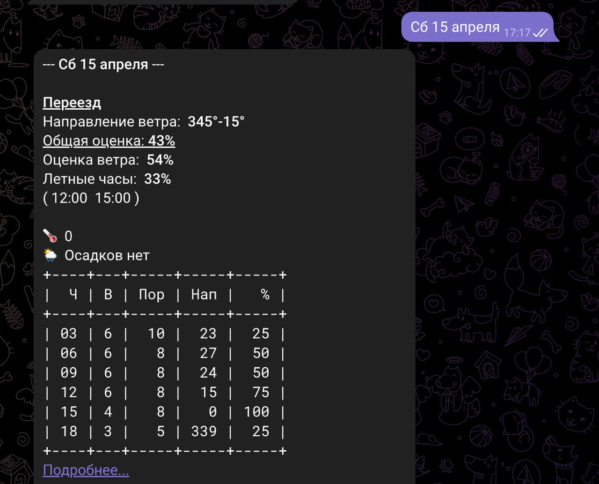

[](https://www.python.org/)


# Parabot
<b> link to bot: https://t.me/para_kzn_bot </b>

## About: 
This project was created for the paragliding community.
The bot monitors the weather forecast and tells you when and where
you can fly and with what probability. Simplifies the choice of a place for flights.

## Stack
### telegram bot
1. `framework aigram`
2. `Aiohttp`
3. `Cron` - running reminder file on the server
4. `API` - getting up-to-date weather forecast and communication with django-admin

### Admin-panel
1. `Djando`
2. `djangorest-framework`
3. `PstgreSQL`

# How it works:
## Bot
1. Choose a city
2. Select a date or show all
3. And see where you can go to fly



Every day the user receives a reminder of the flying day in the next 5 days. The user can refuse or resume the mailing list using the commands `/stop` , `/go`


### Usage

The Paraglider Bot responds to the following commands:

- `/start` - Begins the conversation with the bot.
- `/help` - Displays a help message with a list of available commands.
- `/days` - manually update days
- `/city` - select another city
- `/get_spot` - View added slides in this city
- `/stop` - disable notifications
- `/go` - enable notifications

## Admin-panel
In the admin panel, you can add new flight locations and edit existing ones.
### Usage

### Fronted available at

```commandline
http://127.0.0.1:8000/
```

### Admin panel available at

```commandline
http://127.0.0.1:8000/admin
```
## Installation
Clone this project and create a virtual environment in the project directory.

```commandline
python -m venv venv
source venv/bin/activate
```
install requirements

```commandline
make requirements
```

### Run migrations

```commandline
make migrate
```
### Run create superuser

```commandline
make createsuperuser
```

### Run server

```commandline
make runserver
```

### Create .env and check set up

```commandline
make env_bot
```
fill out .env and setup.py
````
TOKEN = your telegram token
API_KEY = your key for https://openweathermap.org/api
ADMIN_LOGIN = ypor login for Django admin
ADMIN_PASSWORD = ypor password for Django admin
````


